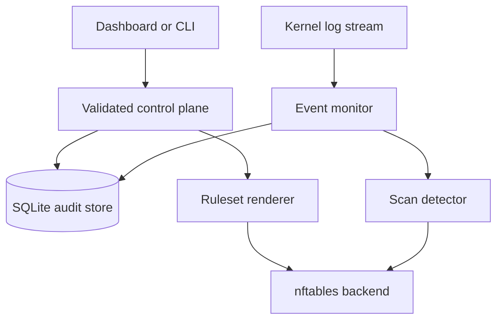

# Architecture

SentinelGate separates policy intent from enforcement so the same application can run as a
safe portfolio demonstration or control a Linux lab firewall.

## Components

| Component | Responsibility | Trust boundary |
|---|---|---|
| Domain models | Validate networks, ports, protocols, rule ids, and priorities | Rejects untrusted API/CLI input |
| SQLite repository | Persists rules, events, bans, and snapshots | Parameterized SQL; local filesystem permissions still matter |
| Ruleset renderer | Converts validated policy into one `inet` table | No raw rule fragments are accepted |
| nftables backend | Checks and atomically applies a complete table | Requires `CAP_NET_ADMIN` only in real mode |
| Event monitor | Parses only `SG_*` kernel-log records | Treats log lines as untrusted input |
| Scan detector | Detects many attempts across several ports in a time window | Suppresses automatic bans for management addresses |
| FastAPI control plane | Authenticates remote API requests and exposes local UI | Non-loopback binding requires a bearer token |

## Ruleset order

Each chain processes traffic in this order:

1. Loopback where applicable.
2. Established and related state.
3. Invalid-state rejection.
4. Dynamic IP blocklists.
5. Protected management access for the input chain.
6. Required ICMP/ICMPv6.
7. Custom rules sorted by ascending priority.
8. Rate-limited default-deny logging and the configured chain policy.

Logging and verdicts are deliberately emitted as separate nftables rules. A rate limit must
limit only log creation—not the actual blocking decision.

## Data flow and rollback

A deployment renders enabled rules plus unexpired dynamic bans. In real mode, the backend checks
the exact transaction with `nft --check` and then applies it with `nft -f -`. SentinelGate stores
the rendered policy digest and full policy text only after the backend accepts it. Rollback takes
a stored policy, validates it through the same backend, and records a new snapshot rather than
rewriting history.

